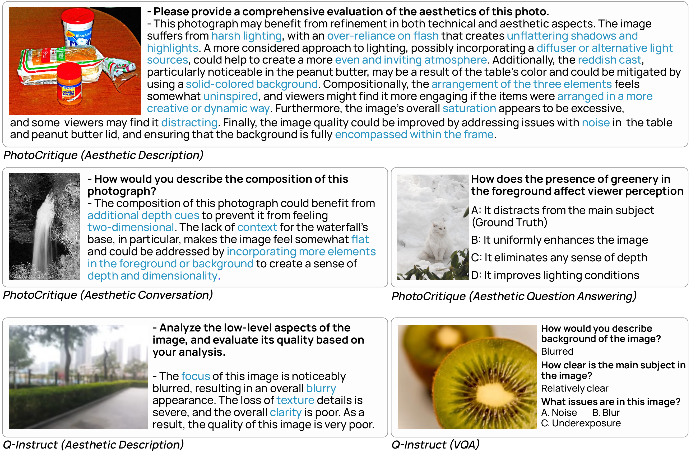
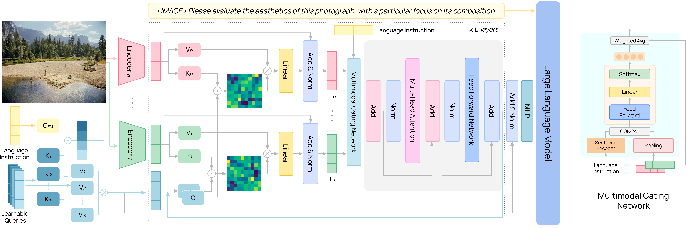

# 📸 [CVPR 2025] The-Photographers-Eye
**The Photographer's Eye: Teaching Multimodal Large Language Models to See, and Critique Like Photographers**

> Official repository for the CVPR 2025 paper:  
> [The Photographer's Eye: Teaching Multimodal Large Language Models to See, and Critique Like Photographers](https://openaccess.thecvf.com/content/CVPR2025/papers/Qi_The_Photographers_Eye_Teaching_Multimodal_Large_Language_Models_to_See_CVPR_2025_paper.pdf)

---

## 🔍 Overview
We introduce **The Photographer’s Eye (PhotoEye)**, a multimodal large language model trained to *see* and *critique* photographs like professional photographers.

<div align="center">
  
</div>

---

## 📂 Resources
- Due to company policy, the **PhotoCritique** dataset is not publicly available at this time.
  However, in our paper we provide a detailed description of how to derive PhotoCritique from the original DPChallenge dataset, **DPC2022** ([paper](https://arxiv.org/pdf/2211.15378)).  
  The DPC2022 dataset can be downloaded here: [Google Drive](https://drive.google.com/drive/folders/1KqZZCwdA3hw09jkavmJYjID_qeibRXwM?usp=drive_link).

- **PhotoBench**: [Google Drive](https://drive.google.com/file/d/1vFQA3Lrj3USukwKhhQm3cTGjpooHzMlu/view?usp=drive_link).  
  This version is a subset filtered using an LLM.  
  A future release may include a version curated by expert human annotators.

---

## 📊 Dataset: PhotoCritique
We release **PhotoCritique**, a large-scale instruction-tuning dataset with ~2.63M samples.

### From Raw Comments to Structured Critique
<div align="center">
  
</div>

### Example Data
<div align="center">
  
</div>

### Diversity of Images
<div align="center">
  
</div>

---

## 🧠 Model: PhotoEye
We propose **PhotoEye**, which fuses visual representations from multiple vision encoders under language guidance.

<div align="center">
  
</div>

---

## 📈 Benchmark: PhotoBench
We evaluate on **PhotoBench**, a benchmark covering hundreds of sub-topics across aesthetics, composition, exposure, post-processing, etc.

### Example Questions
<div align="center">
  
</div>

## 📚 Citation

```bibtex
@inproceedings{qi2025photographers,
  title={The Photographer's Eye: Teaching Multimodal Large Language Models to See, and Critique Like Photographers},
  author={Qi, Yichong and Zhang, Xiangyu and Wang, Xinyue and Zhou, Yuchen and Li, Zhiwei and Chen, Yiran and Liu, Shikun and Zhao, Linjie and He, Yinan and Tang, Hao and Zhang, Yixuan and Wang, Xin and Xu, Minghao and Wang, Lei and Lin, Dahua},
  booktitle={Proceedings of the IEEE/CVF Conference on Computer Vision and Pattern Recognition (CVPR)},
  year={2025},
  pages={to appear},
  url={https://openaccess.thecvf.com/content/CVPR2025/papers/Qi_The_Photographers_Eye_Teaching_Multimodal_Large_Language_Models_to_See_CVPR_2025_paper.pdf}
}
